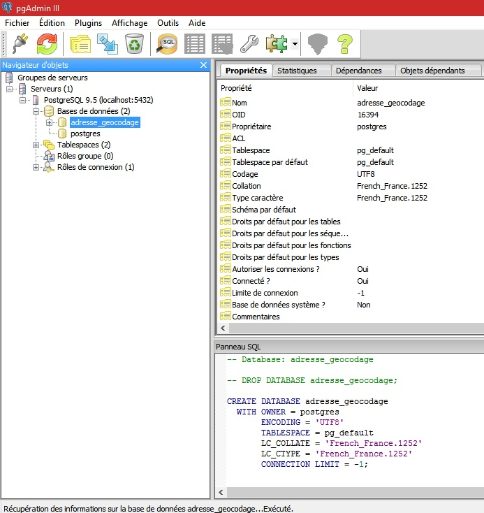
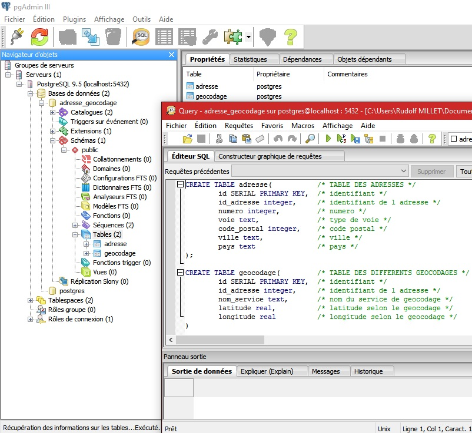
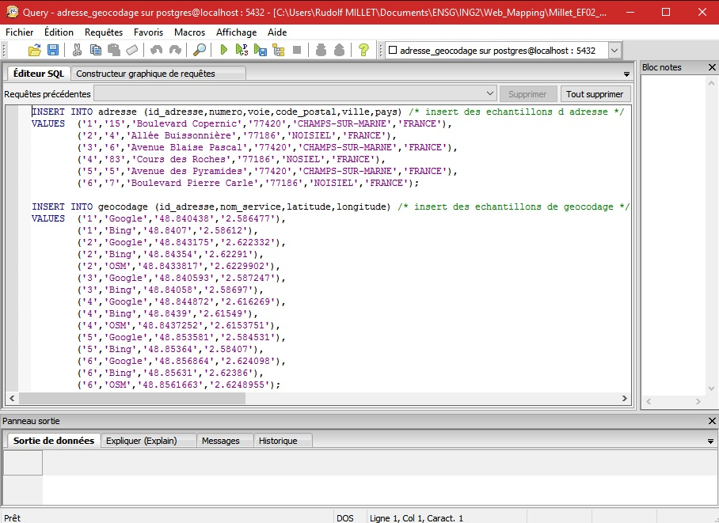
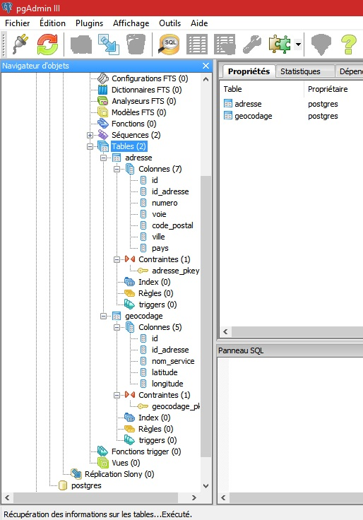
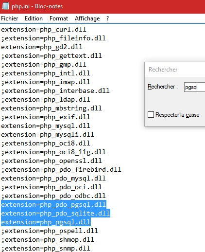
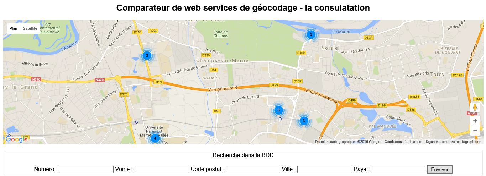
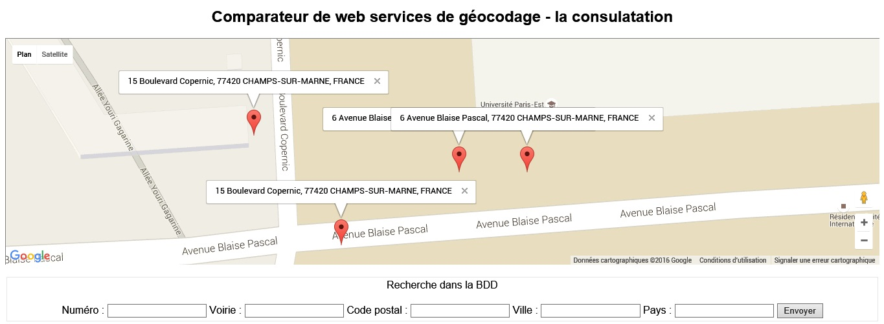
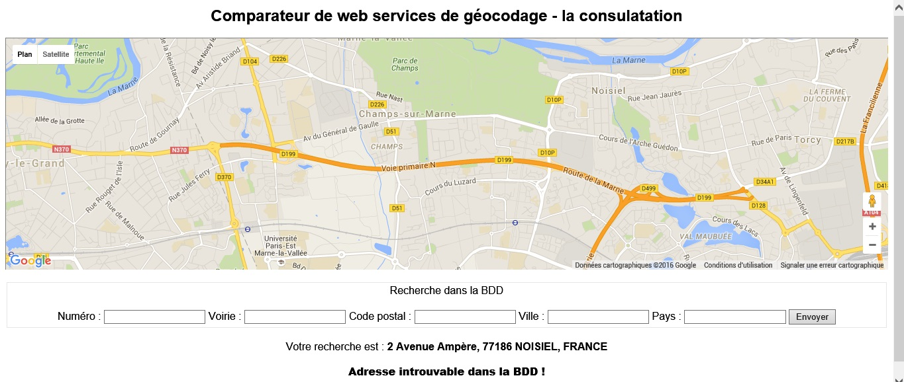
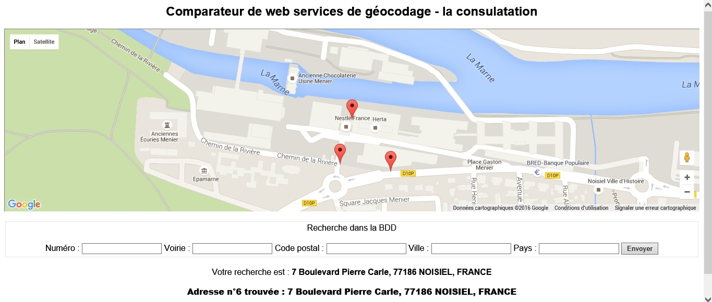
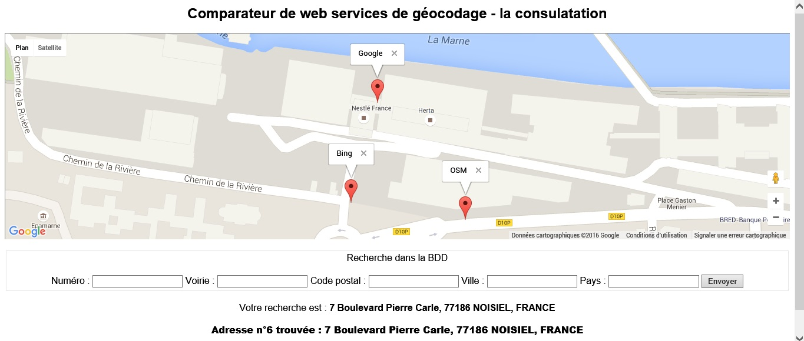

# Webmapping_Geocodage
## Projet Webmapping 2016
### Manuel d'installation
Ce manuel d'installation vous guidera pour la mise en place de la base de données et le bon fonctionnement du code fourni le tout sur un système d'exploitation Windows (10). Le manuel d'installation fait l'hypothèse que vous sachiez manipuler le logiciel "pgAdmin3" et un server tel que "EasyPHP".

#### La base de données
Tout d'abord, il est nécessaire de posséder sur sa machine le logiciel "pgAdmin3" pour la création de la base de données.Une fois "pgAdmin3" lancé, créez la base de données que vous appellerez "adresse_geocodage" :

S'en suit la création des tables à l'aide du fichier "CREATE_TABLE_Rudolf_M.sql" :

Et enfin le remplissage de celles-ci de quelques adresses, choisies de manières arbitraires, et de leurs géocodages récupérées sur Google, Bing et OpenStreetMap (fichier " INSERT_INTO_Rudolf_M.sql") :

Vous devez maintenant avoir une base qui ressemble à ça :

Votre base de données expérimentales est maintenant opérationnelle pour le bon fonctionnement du code fourni. Ce dernier peut même fonctionner sans que "pgAdmin3" ne soit ouvert. Cependant, en cas de problème, il est conseillé de relancer "pgAdmin3". Supprimer puis recréer la base de données peut être une solution.

#### Le serveur

Il est maintenant nécessaire d'installer sur votre machine un serveur tel que MAMP ou EasyPHP. Il est recommandé d'utiliser la version 14.1 d'EasyPHP.

De plus, pour que le code puisse interagir avec la base de données, il est nécessaire d'activer l'extension pgsql de PHP en supprimant les ";" au bon endroit :

Le code de consultation web pour comparer des services de géocodages est réparti sur deux fichiers .php : "index.php" et "recherche.php". Pour le bon fonctionnement du code, il est recommandé de pointé votre serveur vers "index.php", c'est-à-dire la première page que vous devrez ouvrir à chaque première utilisation.
Vous êtes maintenant prêt à vous servir de la page Web, pour pouvez passez au Manuel utilisateur.

### Manuel utilisateur

Vous devez donc dans un premier temps atterrir sur la page d'entrée "index.php" :

Qu'est ce qu'on y voit ? Toutes les adresses de la base de données. L'emprise de la carte est l'emprise de base. Ce n'est qu'à la première utilisation de la page Web qu'il est possible de visualiser toutes les adresses de la base de données.
Il est possible de se déplacer et de voir d'un peu plus près les marqueurs, gérés par le fameux MarkerClusterer, et d'y découvrir ce qu'ils décrivent :

Jusque là, rien de bien compliqué et de bien utile. C'est juste pour visualiser ce que contient la base de données.
La page propose en bas un formulaire pour interroger cette base de données et ainsi visualiser les adresses une par une.

Soit votre recherche ne permet de ne rien trouver :

C'est que l'adresse souhaitée n'existe pas dans la base de données. Vous revenez à l'emprise de base de la carte mais sans marker !

Ou sinon, votre adresse existe bel et bien et vous avez le résultat qui suit :

Les infos bulles s'obtiennent bien évidemment en cliquant sur les markers :

Vous obtenez donc ainsi le résultat souhaité. Pour une adresse extraite de la base de données, vous visualisez autant de markers que la base de données contient de géocodages liés à l'adresse. Grâce à l'info bulle, vous savez de quel service il s'agit.
Dit autrement, vous visualisez les différentes positions d'une seule et même adresse selon le service de géocodage.

### Bibliographie

* [Documentation proposée dans le sujet](https://code.google.com/intl/en/apis/maps/documentation/geocoding/)
* [Explication du géocodage dans son ensemble](https://developers.google.com/maps/documentation/geocoding/intro)
* [Documentation de la fonction pg_connect()](http://php.net/manual/fr/function.pg-connect.php)
* [Comment charger l'extension PHP "pg"](http://stackoverflow.com/questions/7438059/fatal-error-call-to-undefined-function-pg-connect)
* [Documentation de la fonction switch en PHP](http://php.net/manual/fr/control-structures.switch.php)
* [Documentation sur l'utilisation des Marker Google](http://netmacom.fr/blog/webdesign/personnaliser-les-marqueurs-google-maps.html)
* [Documentation sur le "MarkerClusterer"](https://developers.google.com/maps/articles/toomanymarkers%23markerclusterer)
* [Source des fichiers utilisés pour la fonction "MarkerClusterer"](https://github.com/googlemaps/js-marker-clusterer)
